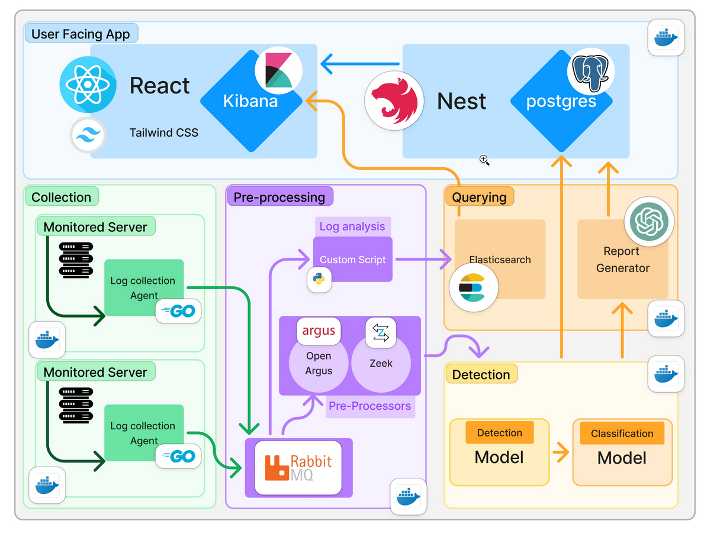

# Smartshield-INSAT (Project Guideline)

This repo simulates an entire architecture using Docker containers, providing an environment with several services, including **Elasticsearch**, **Kibana**, **RabbitMQ**, and a custom **PCAP Processor**. The RabbitMQ service is exposed so that log collector agents, which are deployed on various servers or devices, can send PCAP files to it for processing.

## Architecture Overview


This project sets up an infrastructure with the following services:

- **Elasticsearch**: A powerful search engine for indexing and querying data.
- **Kibana**: A visualization tool to explore data stored in Elasticsearch.
- **RabbitMQ**: A message broker with a management interface.
- **PCAP Processor** (our image): A custom service for processing PCAP files with (zeek/argus/pyshark).
- **Frontend**: A React-based application that provides an interface for interacting with the data and services. [Smartshield-INSAT/Frontend](https://github.com/Smartshield-INSAT/Frontend)
- **Backend**: A NestJS application that serves as the API layer, managing communication between the frontend, PCAP Processor, ML Models.[Smartshield-INSAT/Backend](https://github.com/Smartshield-INSAT/Backend)
- **ML Engine**: A machine learning model for detecting anomalies in the network, used to identify potential threats or irregularities.
- **Generative AI Report Generator**: An AI-driven tool that generates detailed reports based on processed data, providing insights into detected anomalies or patterns.

## Prerequisites

Ensure you have Docker and Docker Compose installed:

- [Docker](https://docs.docker.com/get-docker/)
- [Docker Compose](https://docs.docker.com/compose/install/)

## How to Run

1. **Clone the repository** (if applicable):
   ```bash
   git clone <your-repository-url>
   cd <your-repository-folder>
   ```

2. **Start the services**:
   ```bash
   docker-compose up -d
   ```

3. **Access the services**:
   - **Elasticsearch**: [http://localhost:9200](http://localhost:9200)
   - **Kibana**: [http://localhost:5601](http://localhost:5601)
   - **RabbitMQ Management UI**: [http://localhost:15672](http://localhost:15672)
     - Username: `guest`
     - Password: `guest`

4. **Check running containers**:
   ```bash
   docker-compose ps
   ```
5. **run the ML API**:
    [Smartshield-INSAT/MLEngine](https://github.com/Smartshield-INSAT/MLEngine).
    * Build the Dockerfile:
        ```bash
        docker build -t your-image-name .
        ```
    * Create the container and add it to the network `rabbitmq_net`:
        ```bash
        docker run -d --name your-container-name --network rabbitmq_net -p 8002:8002 your-image-name
        ```
6. **Run the Report Generator**:  
   To generate reports from the processed data, use the [Smartshield-INSAT/Report-Generator](https://github.com/Smartshield-INSAT/Report-Generator). Follow these steps to build and run the report generator:
   
   
   * Clone the repository:
     ```bash
     git clone https://github.com/Smartshield-INSAT/Report-Generator
     cd Report-Generator
     ```
   * Build the Dockerfile:
     ```bash
     docker build -t report-generator .
     ```
   * Run the container:
     ```bash
     docker run -d --name report-generator --network rabbitmq_net -p 8003:8003 report-generator
     ```
   * Access the Report Generator API:
     - API endpoint: `http://localhost:8003`
7. **Run Front and Backend**
  for the backend you just need to run the docker compose 
  for the frontend just use npm install/ npm start
8. **Install the agent in the servers for monitoring**
  [Smartshield-INSAT/tcpdump-wrap](https://github.com/Smartshield-INSAT/Logs-Extraction/tree/main/tcpdump-wrap)

## Stopping the Services

To stop and remove the containers:
```bash
docker-compose down
```

## Notes

- Make sure the Docker network `rabbitmq_net` exists. If not, create it manually:
  ```bash
  docker network create rabbitmq_net
  ```
- The `pcap_processor` service is dependent on RabbitMQ, so ensure that RabbitMQ is up and running before starting any processing tasks.
- Data for RabbitMQ is persisted using the `rabbitmq_data` volume.

## Cleaning Up

To remove all containers, networks, and volumes created by this setup:
```bash
docker-compose down -v
```
